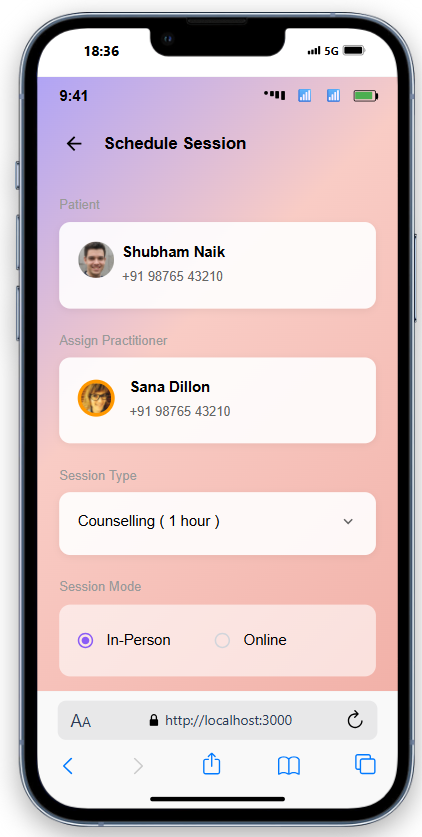

# Doctor Appointment Scheduling System


A modern doctor appointment scheduling system built with Next.js, React, and Material UI. This application allows patients to book sessions with practitioners and manage their appointments efficiently.

## Live Demo

Check out the live demo: [https://docschedule.netlify.app/](https://docschedule.netlify.app/)

## Features

- **User-friendly Interface**: Clean and intuitive design for easy navigation
- **Session Management**: Schedule, view, and manage upcoming and past sessions
- **Patient Information**: Collect and store patient details securely
- **Responsive Design**: Works seamlessly on both desktop and mobile devices
- **Performance Optimized**: Fast loading times and smooth animations

## Technologies Used

- **Frontend**: Next.js, React.js
- **UI Framework**: Material UI (MUI)
- **State Management**: React Hook
- **Form Handling**:  Formik 


## UI Screens

### Dashboard

_The main dashboard showing upcoming and past sessions_


### Available Doctors

_Available Doctors showing doctors list_

### New Session Form (Screen 1)

_Form to schedule a new appointment with patient details_

### New Session Form (Screen 2)

_Form to schedule a new appointment with patient details_

### Calendar View

_Interactive calendar for selecting appointment dates_

## Installation

1. Clone the repository:
```bash
git clone https://github.com/Aftab1999/doctor-appointment.git

cd doctor-appointment

npm install

npm run dev